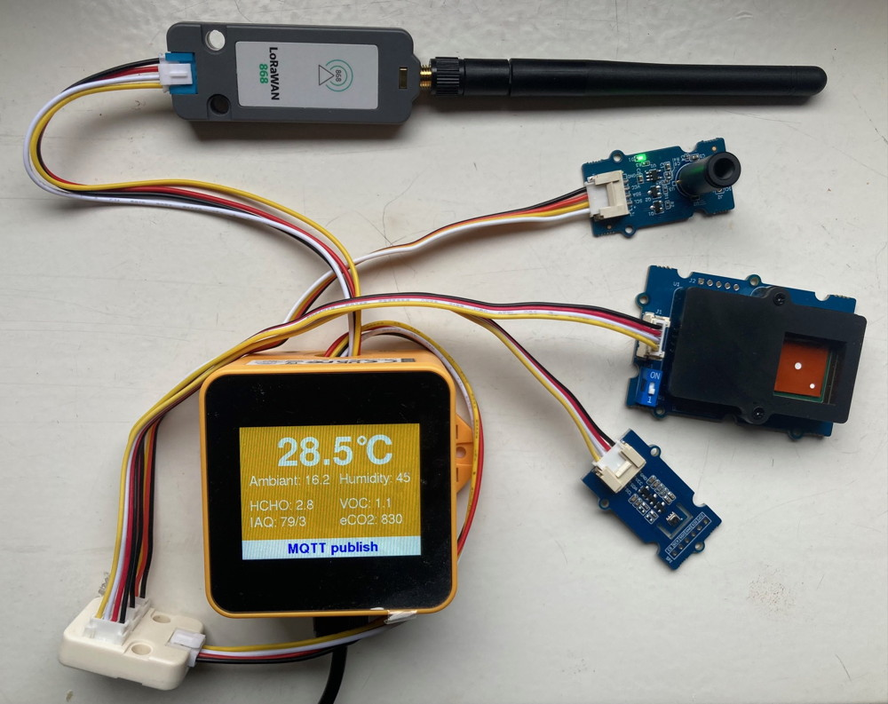

# M5Stack TOUGH wireless sensor hub

## Motivation

A simple and compact system for connecting a few low-cost sensors was proposed for an internal 
development project (RICE - Rapid Instrumentation and Control Environment) to continuously
monitor an injection moulding machine. For flexibel wireless integration, the sensor readings,
which are used as input for a ML model, had to be transmitted more or less in real time via
different channels (WiFi/MQTT, Bluetooth LE/GATT and LoRaWAN). 

## Hardware

An [M5Stack TOUGH device](https://docs.m5stack.com/en/core/tough) was procured as test equipment
and equipped with a few I2C sensors and a [serial LoRaWAN module](https://docs.m5stack.com/en/unit/lorawan868)
from M5Stack (ASR6501). Unfortunately, our device did not have an internal RTC backup 
battery. We placed an additional small LiIon cell (400mAh) in the yellow housing, which feeds
the RTC if the USB  cable is disconnected and as a bonus feature also enables autonomous 
operation for up to 90 minutes.

The initial sensor set consisted of a
[Bosch BME680](https://www.bosch-sensortec.com/products/environmental-sensors/gas-sensors/bme680/)
(temperature, humidity, IAQ, eCO2 and VOC), [Sensirion SFA30](https://sensirion.com/products/catalog/SFA30)
(humidity, formaldehyde) and
[Melexis MLX90614](https://www.melexis.com/en/product/MLX90614/Digital-Plug-Play-Infrared-Thermometer-TO-Can)
(non-contact IR temperature sensor with 5° FOV).

 

 

## Firmware

To compile the wireless sensor hub firmware for the M5Stack TOUGH, which is based on 
ESP32 microcontroller, download [Visual Studio Code](https://code.visualstudio.com/) 
and install the [PlatformIO add-on](https://platformio.org/install/ide?install=vscode). 
Open the downloaded project directory and adjust the settings in `include/config.h`
to  your needs. By default the sensor data is only published via WiFi/MQTT. Most 
options can later be reconfigured under `Setup` in [WiFiManager's](https://github.com/tzapu/WiFiManager)
configuration portal (see section 'Initial Setup').

Sensor readings from the [BME680](https://www.bosch-sensortec.com/products/environmental-sensors/gas-sensors/bme680/) 
are derived from Bosch's [BSEC library](https://github.com/boschsensortec/BSEC-Arduino-library/).
This partially precomplied library is only available for use after accepting its 
[software license agreement](https://github.com/boschsensortec/BSEC-Arduino-library/blob/master/LICENSE).

Since the firmware was developed on a MacBook you probably need to adjust the [upload port
settings](https://docs.platformio.org/en/stable/projectconf/section_env_upload.html)
in `platformio.ini`. The M5Stack TOUGH device uses a 
[CH9102 Chip](https://docs.m5stack.com/en/core/tough#driver-installation) to connect 
the ESP32 to USB. You might need to install additional drivers for your OS.

For firmware updates after the initial USB upload you can use the
[WiFiManager's](https://github.com/tzapu/WiFiManager) OTA option.

## Initial setup

On first power-up, the [WiFiManager](https://github.com/tzapu/WiFiManager) 
will create the access point `SensorHub-XXXXXX` to configure device parameters 
and to connect the M5Stack TOUGH to your local WiFi network. A random WPA password
is shown on its display. After saving the WiFi credentials, it will received an IP 
via DHCP, which is displayed together with the WiFi RSSI at system startup.

When the M5Stack TOUGH has started to display sensor readings (see photo above), the 
[BME680 sensor](https://www.bosch-sensortec.com/products/environmental-sensors/gas-sensors/bme680/) 
is still calibrating and no values for IAQ (air quality index), VOC (volatile organic
compounds) and eCO2 (estimated value for CO2) are displayed. The first readings should show
up after about 5 minutes with an IAQ accuracy indicator of 1 (value after slash). When the
IAQ accuracy  eventually reaches 3, [after exposing it to clean and polluted air for 30 minutes each]
(https://community.bosch-sensortec.com/t5/MEMS-sensors-forum/Calibration-BME680/td-p/51902), 
the sensor is fully calibrated. It is recommended to initially run a new BME680 sensor
for 48 hours to "burn it in". The automatically calulated calibration settings from 
the [BSEC library](https://github.com/boschsensortec/BSEC-Arduino-library/) are saved 
to flash every 2 hours and are reloaded when the M5Stack TOUGH is restarted. At device 
startup you have the option to reset the previously saved BSEC settings to recalibrate 
the BME680 sensor for a different environment.

In normal operation, when the screen with regularly updated sensor readings is displayed,
you can restart the sensor hub by swiping horizontally from left to right across the
touchscreen. When restarting, you will be asked whether youwant to start the local access
point to reconfigure the sensor hub.

## Contributing

Pull requests are welcome! For major changes, please open an issue first to 
discuss what you would like to add or change.

## License

Copyright (c) 2023-2024 Lars Wessels, Fraunhofer IOSB  
This software was published under the Apache License 2.0.  
Please check the [license file](LICENSE).
